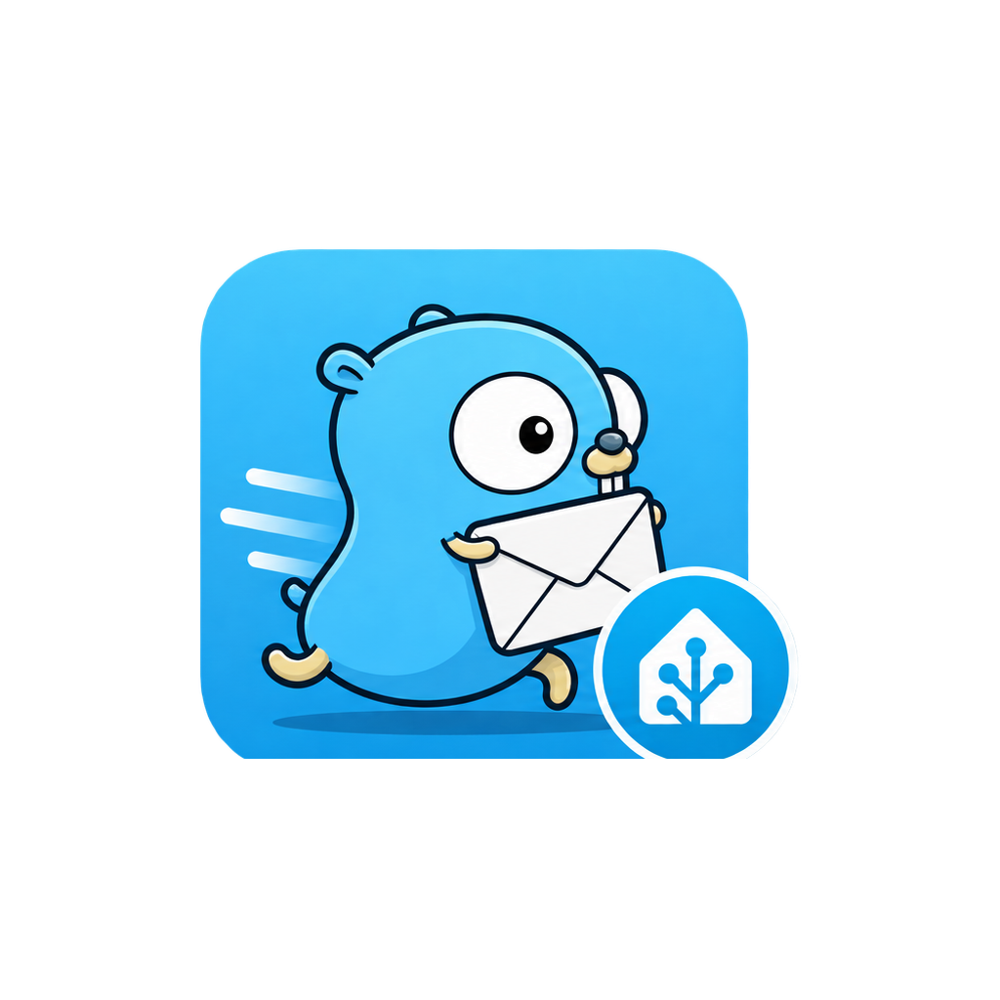

# Gotify MU for Home Assistant

<p align="center">
  
</p>


A Home Assistant custom integration for [Gotify MU](https://github.com/gigabytegrove/gotify-mu).

It provides native Home Assistant notification entities for Gotify MU Channels and optional realtime inbound Channel messages for two-way automations.

## Features

- UI setup through **Settings → Devices & services**
- No `configuration.yaml` changes required
- Standard Home Assistant `notify` entity
- Native `gotify_mu.send` action with priority and Markdown support
- Exact application-token validation without creating a test notification
- Stable Channel identity on current Gotify MU servers
- Optional client token for realtime inbound messages
- Home Assistant `event` entity containing inbound Channel messages
- Connection-status binary sensor for the inbound WebSocket
- Automatic reconnect with bounded backoff
- Reauthentication and reconfiguration flows
- Multiple Gotify MU Channels by adding multiple integration entries
- Config-entry diagnostics with credentials redacted
- TLS verification control for private/self-signed deployments
- HACS-compatible repository layout
- Legacy fallback for Gotify-compatible servers without the MU identity endpoint

## Requirements

Outbound notifications require:

- a Gotify MU server URL
- an application token for the Channel

Realtime inbound messages additionally require a Gotify MU **client token** belonging to a user who can access the Channel.

Current Gotify MU builds expose `GET /application/current`, allowing this integration to identify the application token's exact Channel automatically. Older Gotify-compatible servers still work for outbound notifications using a safe validation fallback.

## Installation

### HACS

Add this repository to HACS as a **Custom repository** with category **Integration**:

```text
https://github.com/gigabytegrove/gotify-mu-ha
```

Install **Gotify MU**, then restart Home Assistant.

### Manual

Copy:

```text
custom_components/gotify_mu
```

to:

```text
/config/custom_components/gotify_mu
```

Restart Home Assistant.

## Setup

Open:

**Settings → Devices & services → Add integration → Gotify MU**

Enter:

- **Server URL** — for example `https://push.example.com`
- **Application token** — the application token for the Gotify MU Channel
- **Client token** — optional; required only for inbound/two-way messages
- **Verify TLS certificate** — keep enabled unless you deliberately use a trusted private certificate that Home Assistant cannot validate

On current Gotify MU builds, the Channel is detected automatically from the application token. On older servers, the integration asks you to choose or name the Channel after credential validation.

## Sending notifications

Home Assistant creates a notification entity for each configured Gotify MU Channel.

```yaml
action:
  - action: notify.send_message
    target:
      entity_id: notify.gotify_mu_notifications
    data:
      title: "Gigabyte Grove"
      message: "Home Assistant is online."
```

Home Assistant chooses the final entity ID, so use the entity picker rather than assuming the example ID.

### Gotify MU action

For Gotify-specific priority and Markdown controls, use:

```yaml
action:
  - action: gotify_mu.send
    data:
      title: "Greenhouse Alert"
      message: "**Temperature is above 100°F.**"
      priority: 8
      markdown: true
```

If multiple Gotify MU entries are configured, the action UI can target a specific config entry. If no entry is specified, the first loaded Gotify MU entry is used.

## Inbound / two-way messages

When a client token is configured and **Enable inbound messages** is on, the integration maintains a Gotify MU WebSocket connection.

Each incoming message from the configured Channel updates the integration's **Messages** event entity with:

- message ID
- Channel ID
- title
- message body
- priority
- date
- sender user ID
- sender name
- Gotify extras

The integration also creates an **Inbound connection** binary sensor. Its attributes expose reconnect count and the most recent stream error.

Messages sent by the same Home Assistant config entry are tagged and ignored by that entry's inbound stream, preventing an immediate send → receive automation loop.

### Safety behavior

Inbound Gotify MU messages are **events only**. The integration never interprets message text as a Home Assistant command and never executes services automatically. If you want a Chat Channel message to perform an action, create an explicit Home Assistant automation with the conditions and permissions appropriate for that action.

## Credential validation

Current Gotify MU servers provide a token-identity endpoint that returns the authenticated Channel metadata with the token redacted.

For older Gotify-compatible servers, application-token validation does **not** send a visible test message. The integration submits an intentionally incomplete `/message` request. Gotify authenticates before validating the body, so a valid token fails safely with HTTP 400 before message creation while an invalid token fails with HTTP 401/403.

## Reauthentication and reconfiguration

If Gotify MU rejects a stored token, Home Assistant starts a reauthentication flow instead of requiring the integration to be deleted and recreated.

**Reconfigure** allows you to change the server URL, display name, TLS validation, or replace/remove the optional client token. Removing the client token automatically disables inbound streaming while keeping outbound notifications intact.

## Security

- Tokens are stored in Home Assistant config-entry storage, not `configuration.yaml`.
- Diagnostics redact both application and client tokens.
- The application token is never included in the config-entry unique ID.
- Current Gotify MU servers return application identity with the token field removed.
- Use HTTPS when the Gotify MU server is reached over an untrusted network.
- Disable TLS verification only when you intentionally trust the target server/network.
- Inbound messages never execute Home Assistant actions on their own.

## Compatibility

The integration publishes through Gotify's compatible API:

```text
POST /message
X-Gotify-Key: <application-token>
```

Gotify MU-specific capabilities are additive. Outbound-only operation remains compatible with Gotify-style servers that do not expose the MU identity endpoint.

## Development

The repository includes:

- Python compile and JSON validation
- Ruff linting
- Hassfest validation
- Home Assistant config-flow tests

See [CHANGELOG.md](CHANGELOG.md) for release history.

## License

MIT

## Branding

The integration ships its Home Assistant brand assets directly with the custom component:

- `custom_components/gotify_mu/brand/logo.png` — canonical Gotify MU logo
- `custom_components/gotify_mu/brand/icon.png` — square Home Assistant integration icon

<p align="center">
  
</p>
